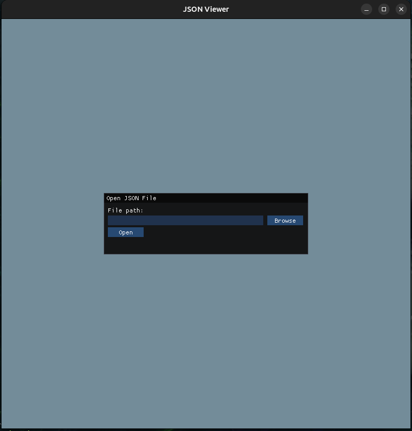
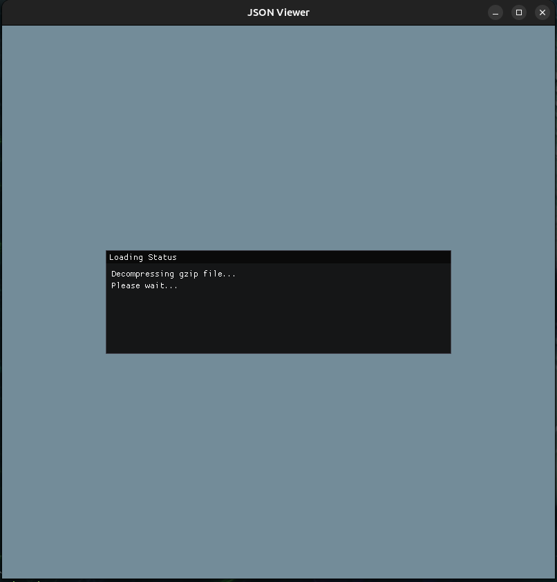
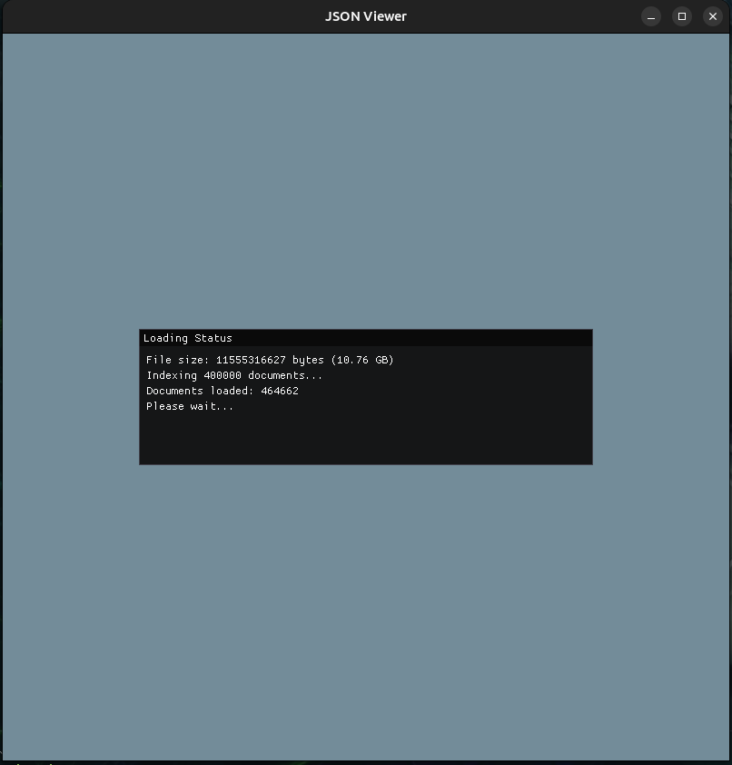
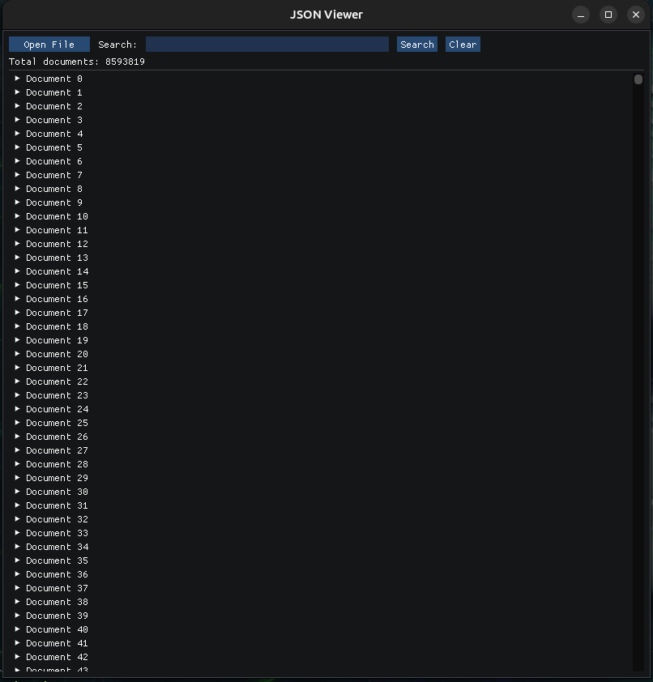
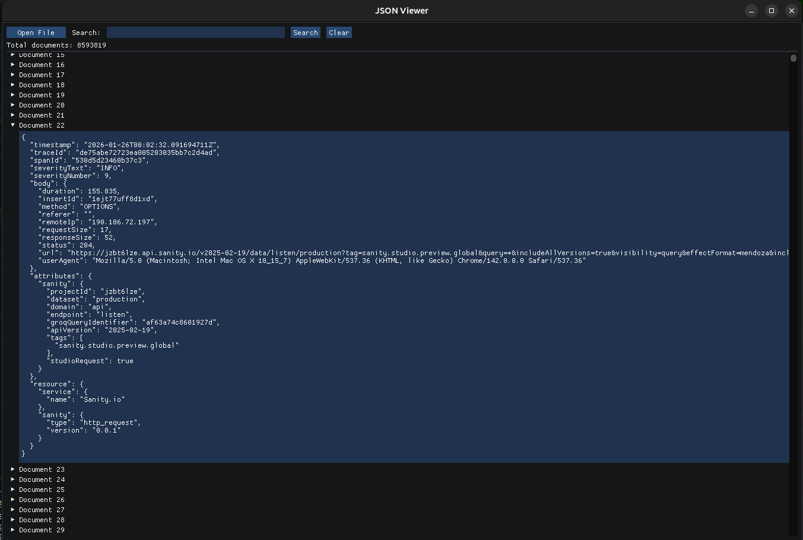

# JSON Viewer

[](https://github.com/A1DS19/high-performance-json-viewer/actions/workflows/build.yml)
[](https://github.com/A1DS19/high-performance-json-viewer/releases)
[](LICENSE)
[](https://isocpp.org/)
[](https://github.com/A1DS19/high-performance-json-viewer)

A high performance JSON viewer.

## Build

### Release / Production

```bash
make release
```

This creates an optimized binary in `bin/main`.

### Install System-wide

```bash
make install
```
Installs to `/usr/local/bin/json_viewer`.

## Screenshots












